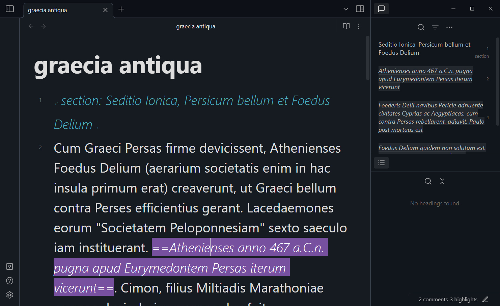

# Enhanced Annotations
An obsidian plugin that extends the functionality of comments and highlights.  

## Features
- Explore comments/highlights of the active file using a sidebar view.
- Create notes from comments/highlights using the editor context menu.
- Copy comments/highlights of selected files from the file explorer context menu.
- Assign custom styles to different types of comments/highlights based on their label (e.g., `<!--title: ...-->`, `<!--todo: ...-->`).
- Use a trigger phrase to insert a labeled comment (e.g., `//todo` to insert `<!--todo: -->`).

